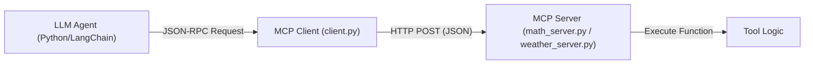
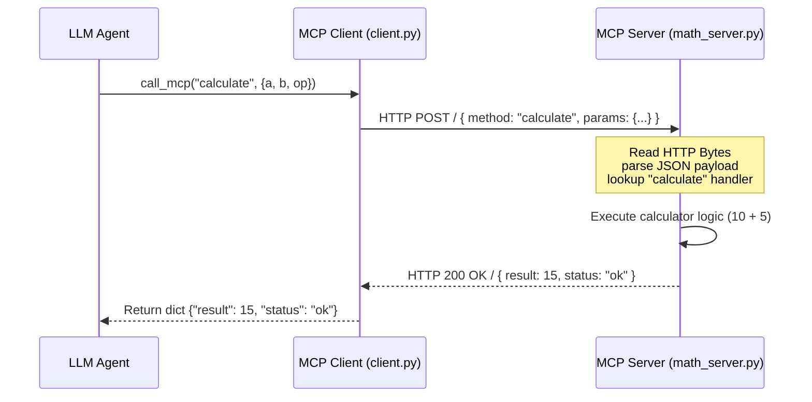
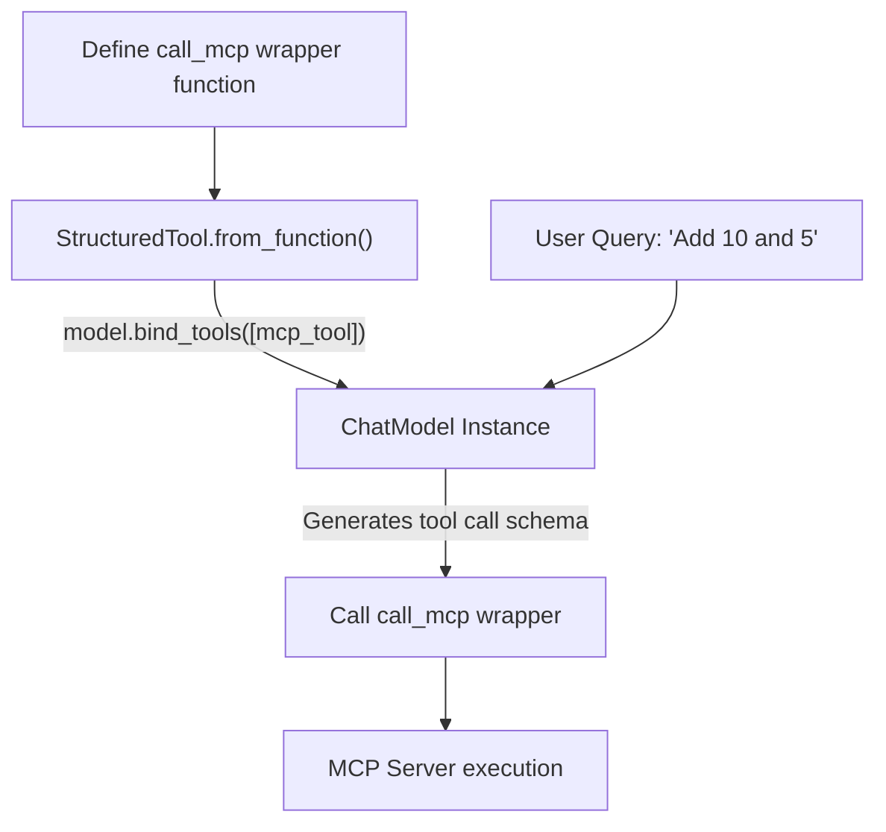

# 📦 MCP (Model Context Protocol) Study Guide & Reference

This folder contains the codebase (`client.py`, `math_server.py`, and `weather_server.py`) demonstrating integration with the **Model Context Protocol (MCP)**. This guide explains the core concepts, protocols, runtime architectures, and integration workflows implemented in the code.

---

## 🎯 What is MCP?

The **Model Context Protocol (MCP)** is a lightweight, standardized JSON-RPC specification designed to connect LLM-driven agents to external systems, tools, and databases. 

Traditionally, developers hardcode API calls and tool execution wrappers directly inside their agent packages. This approach introduces coupling and scaling challenges:
*   **Coupling**: If a tool updates, the agent code must be redeployed.
*   **Language Locking**: Agent code and tool integrations must be written in the same programming language (typically Python).
*   **Security Risk**: Tools execute within the same process context as the agent, complicating permissions and sandboxing.

MCP solves these problems by **decoupling** the agent client from the tool server. The agent simply communicates via standard JSON payloads over a transport layer (like HTTP, WebSockets, or standard input/output streams), enabling modular, language-agnostic integrations.



---

## 🏗️ MCP Architecture In-Depth

MCP divides roles into two clear abstractions: the **MCP Client** and the **MCP Server**.

### 1️⃣ MCP Client (`client.py`)
The MCP Client acts as the gateway for the LLM agent. Its job is to:
*   Expose a single execution function: `call_mcp(method: str, params: dict) -> dict`.
*   Serialize request arguments into the standard protocol payload.
*   Transmit payloads via HTTP POST to the target server's endpoint.
*   Parse standard JSON response packages, catch error status codes, and propagate exceptions back to the agent framework.

```python
# Conceptual client request schema
payload = {
    "method": "calculate",
    "params": {"a": 10, "b": 5, "op": "+"}
}
```

---

### 2️⃣ MCP Server (`math_server.py` & `weather_server.py`)
MCP Servers host the actual execution logic. To remain lightweight and dependency-free, this codebase implements servers using Python's native `http.server.HTTPServer` class.
*   **Request Handling Lifecycle**:
    1.  Listen on a designated local port (e.g. `8000` for Math, `8001` for Weather).
    2.  Receive HTTP POST requests, reading raw body bytes.
    3.  Deserialize bytes into JSON objects, extracting the requested `method` and `params` arguments.
    4.  Dispatch execution to local Python functions using a dispatcher lookup map (e.g. mapping `"calculate"` to the local calculator code).
    5.  Pack the return value or execution errors into a response payload and return it over HTTP.



---

## 🛠️ Exposing MCP Tools inside LangChain

To allow LangChain agents to invoke tools hosted on MCP servers, the client wrapper must be registered in the model's tool list. This is done by wrapping the client's `call_mcp` function in a LangChain `StructuredTool` object.



---

## 📚 Repository Walk-through & Code Map

The code files in this folder are organized as follows:

*   **[`client.py`](file:///f:/WeCloudData/AI/AgenticAI/langchain_ai/MCP/client.py)**: Implements client network logic. Exposes `call_mcp` and handles routing requests to configured server URL endpoints.
*   **[`math_server.py`](file:///f:/WeCloudData/AI/AgenticAI/langchain_ai/MCP/math_server.py)**: Spawns an HTTP service listening on port `8000`. Exposes the `"calculate"` method, executing math operations (`+`, `-`, `*`, `/`) on numeric arguments.
*   **[`weather_server.py`](file:///f:/WeCloudData/AI/AgenticAI/langchain_ai/MCP/weather_server.py)**: Spawns an HTTP service listening on port `8001`. Exposes the `"forecast"` method, returning mock forecast descriptions for requested city parameters.
*   **[`README_MCP_Architecture.md`](file:///f:/WeCloudData/AI/AgenticAI/langchain_ai/MCP/README_MCP_Architecture.md)**: Conceptual overview and detailed diagrams of the protocol framework.
*   **[`docs.MD`](file:///f:/WeCloudData/AI/AgenticAI/langchain_ai/MCP/docs.MD)**: Auto-generated documentation details.

---

## ✅ Best-Practice Study Checklist

*   **Ensure servers are running before calling**: The MCP Client does not auto-start services. Make sure servers are running on their configured ports before running the client.
    ```bash
    python math_server.py      # Runs on port 8000
    python weather_server.py   # Runs on port 8001
    ```
*   **Design tool payloads to be lightweight**: Avoid sending large images, binaries, or raw HTML blocks over MCP to keep transport serialization costs low.
*   **Enforce parameter validation at the server side**: Since the server executes arbitary parameters sent by the LLM, validate argument types and ranges inside the server handler before processing logic.
*   **Wrap errors in standard JSON schemas**: If an operation fails on the server, return a structured error status (e.g. `{"status": "error", "error": "Division by zero"}`) rather than crashing the HTTP worker, allowing the client to propagate errors cleanly.
*   **Isolate and containerize servers**: Keep your services decoupled. Deploy servers in standalone containers or sandbox execution spaces to secure access to system files, databases, or API credentials.
