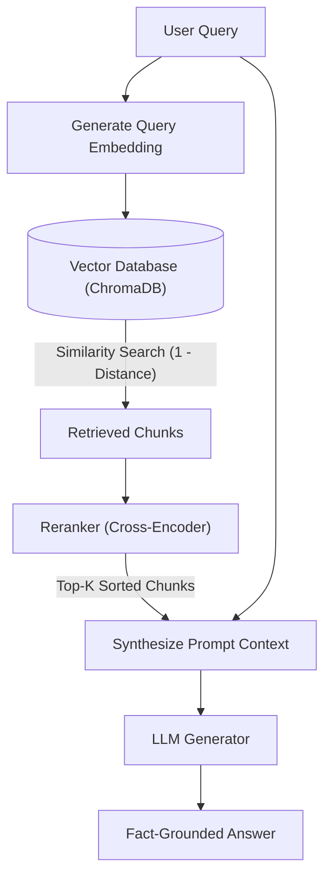
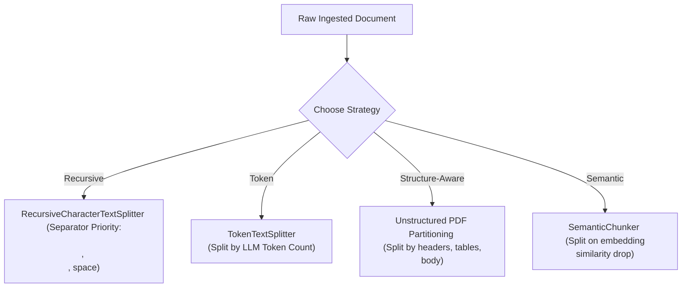
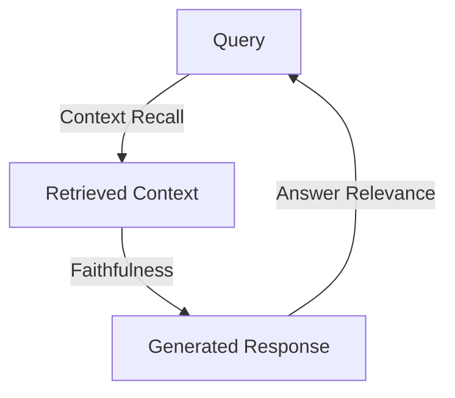

# 📚 RAG (Retrieval-Augmented Generation) Study Guide & Reference

This folder contains notebooks (`document.ipynb`, `RAG_pipeline.ipynb`, and the `foundation/` directory) designed to teach modern Retrieval-Augmented Generation. This guide explains the concepts, algorithms, ingestion pipelines, architectures, and evaluation metrics implemented in the code.

---

## 🎯 What is RAG?

Retrieval-Augmented Generation (RAG) is a technique that enhances an LLM's generative capability by grounding its responses in an **external knowledge base**. 

Instead of relying solely on static, pre-trained parameters (which suffer from knowledge cutoff dates and hallucinations), a RAG system:
1.  **Ingests** documents, chunks them, and stores their vector embeddings in a database.
2.  **Retrieves** the most relevant chunks matching a user's prompt at query time.
3.  **Synthesizes** an answer by feeding the user's query alongside the retrieved documents as context into the LLM.

---

## 🏗️ Core RAG Pipeline In-Depth

### 1️⃣ Data Ingestion & PII Filtering
Before documents can be searched, they must be parsed and sanitized.
*   **Document Loaders**:
    *   `TextLoader` & `DirectoryLoader`: Reads raw strings and handles bulk text ingestion via glob patterns.
    *   `PyPDFLoader` vs. `PyMuPDFLoader`: While both read PDFs, `PyMuPDFLoader` uses the C-based MuPDF library for faster parsing and extracts page boundaries and metadata details.
    *   `YoutubeLoader`: Connects to YouTube APIs to retrieve transcripts directly from a `video_id`.
*   **PII Redaction (Microsoft Presidio)**: As shown in `01_loader.ipynb`, production systems often filter sensitive user data before database insertion. The `AnalyzerEngine` and `AnonymizerEngine` find and replace Personally Identifiable Information (SSN, emails, phone numbers, addresses, license plates) with placeholder tokens (e.g. `<EMAIL>`), protecting user privacy.

---

### 2️⃣ Chunking Strategies (The 6 Families)
Chunking splits large documents into smaller, coherent text blocks. This is critical because LLMs have finite context windows, and embeddings generated from excessively long documents lose semantic precision.

As implemented in `02_chunking.ipynb`, the repository covers:
*   **Fixed-Size & Overlapping**: Splits text into chunks based on a fixed character count. An *overlap* (e.g., 50 characters) is retained between adjacent chunks to prevent sentences from being sliced in half and losing context.
*   **Recursive Character Chunking**: `RecursiveCharacterTextSplitter` splits text based on a prioritized list of separators (typically double-newlines `\n\n`, single newlines `\n`, spaces ` `, and empty strings `""`). It attempts to split paragraphs first, then sentences, keeping semantic units intact.
*   **Token-Based Chunking**: `TokenTextSplitter` measures chunk size by the model's actual token count (e.g. tiktoken/cl100k_base) rather than characters, matching the model's context budget directly.
*   **Structure-Aware Chunking**: Uses layout parsers (such as `unstructured`'s `partition_pdf`) to slice documents based on layout structure (tables, headers, list items, sidebars) rather than arbitrary text lengths.
*   **Semantic Chunking**: `SemanticChunker` uses an embedding model to evaluate similarity between adjacent sentences. When the similarity falls below a calculated threshold, a semantic shift is detected, and a new chunk boundary is formed.
*   **Hierarchical (Parent-Child) Chunking**: Stores small chunks for highly accurate semantic matching, but links each to a larger "parent" context chunk. When the child matches, the parent chunk is sent to the LLM to supply complete contextual details.

---

### 3️⃣ Embeddings & Vector Databases
*   **Embedding Models**: Dense numerical vector models represent text meaning in space. The code uses `SentenceTransformer` with `"all-MiniLM-L6-v2"` (which embeds strings into 384-dimensional dense vectors).
*   **Persistent Vector Database (ChromaDB)**: Unlike in-memory caches, ChromaDB's `PersistentClient` saves the collection index to disk (`data/vector_store`), preventing the need to re-index documents on restart.

---

### 4️⃣ Retrieval & Similarity Metrics
*   **K-Nearest Neighbor Search**: Given a query, the retriever generates a query embedding and finds the closest document vectors in the collection.
*   **Distance to Similarity**: ChromaDB returns distance metrics (typically L2 or cosine distance). The `RAGRetriever` converts distance into a similarity score:
    $$\text{Similarity Score} = 1 - \text{Cosine Distance}$$
    This normalizes scores to evaluate chunk relevance against a set `score_threshold`.

---

### 5️⃣ Reranking
Standard retrievers look at vector similarity, which is efficient but can miss complex dependencies.
*   **Why Rerank?**: A vector search is run with a broad search width (e.g., retrieve $K=20$ chunks).
*   **Cross-Encoder Rerankers**: A Cross-Encoder model performs full attention across the concatenated query and chunk text simultaneously (unlike Bi-Encoders, which embed queries and documents separately). This yields a much more accurate relevance score. The top $K=5$ reranked chunks are then selected for the final context, reducing LLM distraction and context budget.

---

### 6️⃣ RAG Evaluation Metrics (The RAG Triad)
To audit and optimize a RAG pipeline, you must evaluate three core transitions:

*   **Faithfulness (Groundedness)**: Checks if the generated answer is derived *only* from the retrieved context. It flags hallucinations (facts not present in the reference documents).
*   **Answer Relevance**: Checks if the generated response directly answers the user's question, penalizing rambling, off-topic, or evasive answers.
*   **Context Recall**: Evaluates the retriever. It measures whether the retriever fetched all the necessary ground-truth details to address the query.
*   **Context Precision**: Evaluates the retriever's signal-to-noise ratio, checking if the most relevant chunks are ranked at the top of the context block.

---

## 📚 Notebook Walk-through & Code Map

The code files in this folder are organized as follows:

*   **[`document.ipynb`](file:///f:/WeCloudData/AI/AgenticAI/langchain_ai/RAG/document.ipynb)**: Detailed demonstration of data loaders. Shows how to configure `TextLoader`, bulk `DirectoryLoader` lookups, `PyPDFLoader` vs. `PyMuPDFLoader` page extractions, and YouTube transcript downloads via `YoutubeLoader`.
*   **[`RAG_pipeline.ipynb`](file:///f:/WeCloudData/AI/AgenticAI/langchain_ai/RAG/RAG_pipeline.ipynb)**: Implements the customized RAG database structure. Details:
    *   `EmbeddingManager`: Wraps `SentenceTransformer` to encode texts.
    *   `VectorStore`: Creates local persistent directories for `chromadb` collections.
    *   `RAGRetriever`: Processes query embeddings, executes queries, and maps distance to similarity scores.
*   **`foundation/` directory**:
    *   **[`01_loader.ipynb`](file:///f:/WeCloudData/AI/AgenticAI/langchain_ai/RAG/foundation/01_loader.ipynb)**: Walk-through of the end-to-end ingestion pipeline, featuring a PII redaction layer using Microsoft Presidio.
    *   **[`02_chunking.ipynb`](file:///f:/WeCloudData/AI/AgenticAI/langchain_ai/RAG/foundation/02_chunking.ipynb)**: Deep-dive into character, recursive, token, structure-aware, and semantic chunking libraries.
    *   **[`03_embedding.ipynb`](file:///f:/WeCloudData/AI/AgenticAI/langchain_ai/RAG/foundation/03_embedding.ipynb)**: Conceptual playground for embedding dimensions.

---

## ✅ Best-Practice Study Checklist

*   **Filter PII early**: Strip out SSNs, phone numbers, and addresses at the loader stage before writing to shared vector indexes or LLM endpoints to preserve privacy.
*   **Match chunking to document layouts**: Use recursive chunking as a general baseline, semantic chunking for topic-dense content, and structure-aware parsing (e.g., Unstructured) for documents with tables and headers.
*   **Always configure overlap**: Set an overlap of **10% to 20%** of your chunk size to preserve semantic relationships across boundaries.
*   **Map distance to similarity**: Convert cosine distances to a normalized score range ($0$ to $1$) to set stable relevance thresholds.
*   **Use checkpointers to scale**: Persist your vector databases to disk (`chromadb.PersistentClient`) rather than using in-memory databases to avoid re-indexing documents.
*   **Audit with the RAG Triad**: If your agent gives incorrect answers, use Faithfulness, Answer Relevance, and Context Recall metrics to pinpoint whether the issue is in the retriever or the generator.
