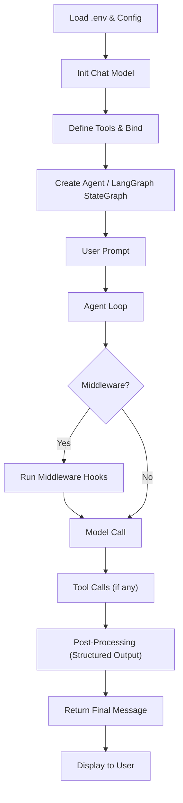

# 📚 Project Overview

This repository is a **learning sandbox** that walks through four major topics in modern LLM‑centric development:

- **LangChain** – core agents, tool binding, middleware, structured output.
- **LangGraph** – graph‑based state management and orchestration.
- **RAG** (Retrieval‑Augmented Generation) – embedding creation, vector stores, and query pipelines.
- **MCP** – Multi‑Channel Protocol integration (example utilities for connecting external services).

## 🎯 Typical End‑to‑End Pipeline

## 📂 Repository Layout

- `langchain/` – notebooks `01_…` to `06_…` covering core LangChain concepts.
- `langGraph/` – examples of state graphs and node/edge definitions.
- `RAG/` – embedding notebooks, vector store setup, retrieval pipelines.
- `MCP/` – configuration and usage examples for the Multi‑Channel Protocol.
- `doc/` – generated architecture & flow diagrams (see `architecture.md`).

## 📄 Navigation

- [LangChain README](./langchain/README.md)
- [LangGraph README](./langGraph/README.md)
- [RAG README](./RAG/README.md)
- [MCP README](./MCP/README.md)

---

*This README serves as a quick‑reference study guide. Each sub‑directory contains a detailed README with topic‑specific explanations and diagrams.*
