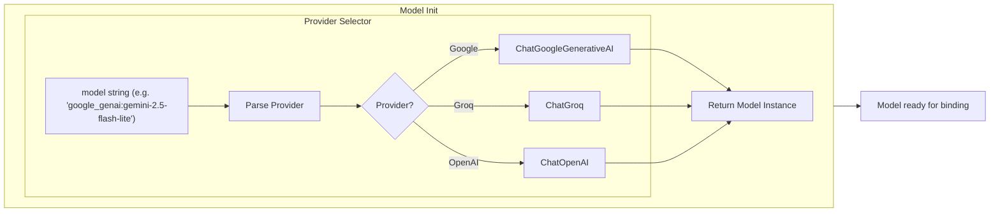
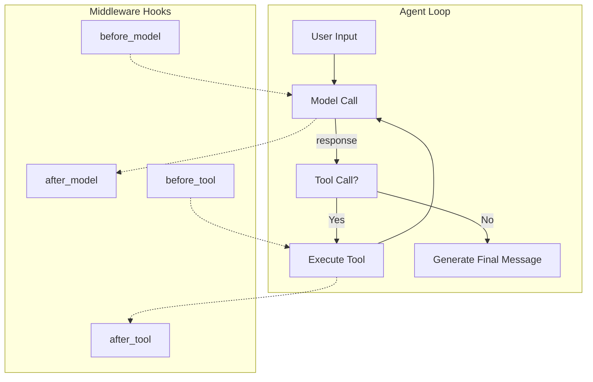
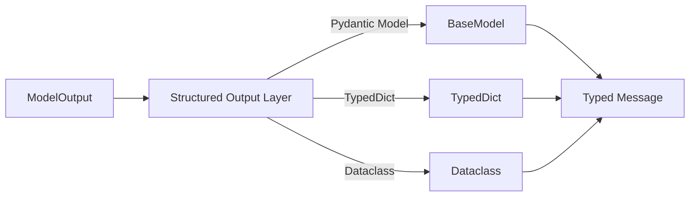
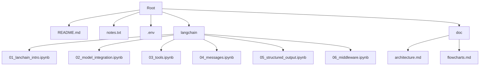

# LangChain Project Architecture & Flow Diagrams

## Overview
This repository demonstrates a **LangChain** workflow covering:
1. **Environment setup** – loading `.env` variables.
2. **Model initialization** – unified `init_chat_model` for Google Gemini, Groq, etc.
3. **Tool definition & binding** – custom Python functions exposed to the LLM.
4. **Agent creation** – `create_agent` (LangChain) or `model.bind_tools()`.
5. **Middleware** – optional hooks that intercept model calls, tool execution, or state updates.
6. **Structured output** – using Pydantic, TypedDict, or dataclasses for typed responses.

The following Mermaid diagrams illustrate the data flow and component interactions.

---

## 1. High‑Level Pipeline
```mermaid
flowchart TD
    A[Start: Load .env] --> B[Init Chat Model]
    B --> C[Define Tools]
    C --> D[Create Agent / Bind Tools]
    D --> E[User Prompt]
    E --> F[Agent Execution]
    F --> G{Middleware?}
    G -->|Yes| H[Run Middleware Hooks]
    H --> I[Model Call]
    I --> J[Tool Calls (if any)]
    J --> K[Post‑processing (Structured Output)]
    G -->|No| I
    K --> L[Return Final Message]
    L --> M[Display to User]
```

---

## 2. Model Initialization (`init_chat_model`)


---

## 3. Tool Definition & Binding
```mermaid
flowchart TB
    T1[Define Python function] --> T2[Add type hints & docstring]
    T2 --> T3[Expose as LangChain Tool]
    T3 --> B1[model.bind_tools([...])]
    B1 --> A1[Agent ready to invoke tools]
```

*Example* (from `01_lanchain_intro.ipynb`):
```python
def get_weather(city: str) -> str:
    """Get the weather for a city"""
    return f"The weather in {city} is sunny."
```

---

## 4. Agent Creation (`create_agent`)
```mermaid
flowchart LR
    M[Chat Model] --> A[create_agent]
    A -->|tools| T[Tool list]
    A -->|system_prompt| S[Prompt]
    A --> AG[Compiled Agent (StateGraph)]
    AG -->|invoke| I[User Message]
```

The compiled agent internally builds a LangGraph `StateGraph` that orchestrates model calls and tool execution.

---

## 5. Middleware Flow


Typical middlewares (see `06_middleware.ipynb`):
- **SummarizationMiddleware** – compresses history when token limits are reached.
- **HumanInTheLoopMiddleware** – pauses for user approval before risky tool calls.
- **PIIMiddleware** – redacts personal data.
- **ToolRetryMiddleware** – retries failing tools.

---

## 6. Structured Output


The `05_structured_output.ipynb` demonstrates converting raw LLM strings into typed Python objects for safer downstream processing.

---

## 7. Directory Layout (simplified)


---

*All diagrams above are embedded in this markdown file. The `doc` folder now contains this `architecture.md` file for quick reference.*
