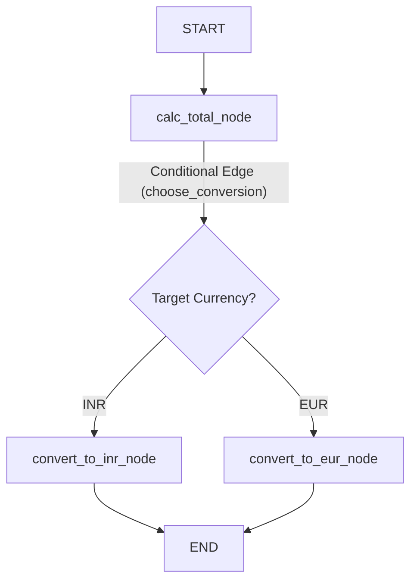
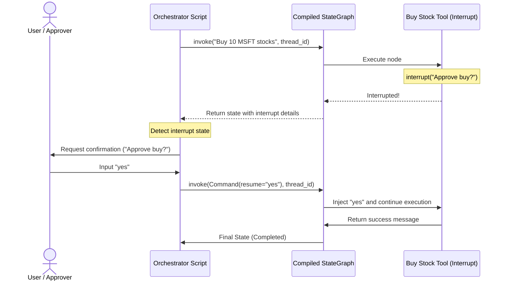
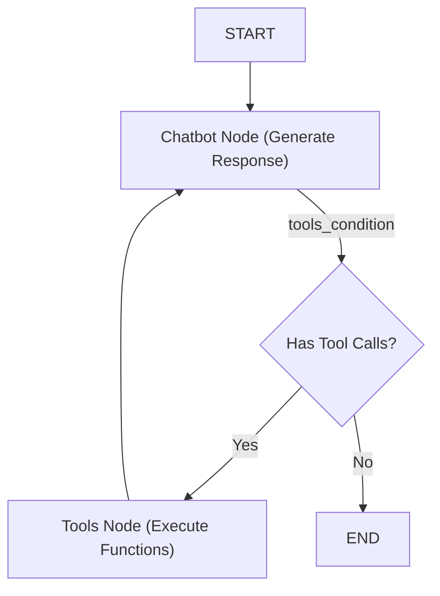

# 📚 LangGraph Study Guide & Reference

This folder contains a collection of Jupyter Notebooks and Python scripts (including the `basic_finanical_usecase/` directory) designed to teach graph-based orchestration for LLM applications. This guide explains the core concepts, runtime mechanics, architectures, and best practices implemented in the code.

---

## 📖 What is LangGraph?

LangGraph is an orchestration layer built on top of LangChain. While standard LangChain excels at linear pipelines, LangGraph models complex, multi-agent, and loop-heavy workflows as a **StateGraph**.

In LangGraph, you define:
1.  **State**: A centralized data structure that is passed from node to node.
2.  **Nodes**: Python functions (or prebuilt logic) that process the state and return updates.
3.  **Edges**: Direct connections that govern transitions between nodes (which can be unconditional or conditional).

---

## 🏗️ Core Concepts Explained

### 1️⃣ State Definitions & Reducers
The `State` is a shared schema that travels through the graph.
*   **TypedDict Schema**: Usually structured as a Python dictionary specifying keys and value types.
*   **Reducers (`Annotated[list, add_messages]`)**: By default, when a node returns a dictionary key, it overwrites the existing value. Reducers specify *how* to combine the old value with the new value. The `add_messages` reducer automatically appends new messages to the existing list, managing message history history seamlessly.

```python
class State(TypedDict):
    # The add_messages reducer appends new messages rather than overwriting
    messages: Annotated[list, add_messages]
    last_tool_output: str
```

---

### 2️⃣ Nodes & Node Types
A node is a function (or object) that takes the current state as input and returns a dictionary updating one or more keys.
*   **Custom Python Nodes**: Regular functions executing custom business logic, API queries, or invoking LLMs.
*   **ToolNode**: A prebuilt node that executes LangChain tools when requested by the model's `tool_calls` field. It automatically formats the output into `ToolMessage` instances and appends them to the state.

---

### 3️⃣ Edges & Graph Routing
Edges direct the flow of execution from one node to another.
*   **Unconditional Edges**: Links that always trigger (e.g. `START -> chatbot`).
*   **Conditional Edges**: Dynamic routing decisions based on a router function.
    *   *System Router*: `tools_condition` is a prebuilt router that checks if the last message contains `tool_calls`. If yes, it routes to `"tools"`; if no, it routes to `END`.
    *   *Custom Router*: A function that inspects the current state and returns the target node name as a string (e.g. checking user currency selection to route to INR or EUR calculation nodes).



---

### 4️⃣ Checkpointing, Memory, & Threads
To support long-running or multi-turn chat loops, LangGraph uses **Checkpointers**.
*   **State Persistence**: An active checkpointer (e.g. `MemorySaver` for in-memory or a SQLite database saver) serializes and saves the state of the graph after every node execution.
*   **Threads (`thread_id`)**: A thread configuration is passed to `graph.invoke`. This allows the engine to load the correct state history. Multiple users or sessions can interact with the same graph concurrently under separate `thread_id` namespaces.

---

### 5️⃣ Human-In-The-Loop & Interruption Loops
Some actions require human verification before execution. LangGraph provides first-class support for pausing and resuming graphs.

*   **Interrupts (`interrupt()`)**: When a node or tool calls `interrupt("prompt_string")`, execution is halted immediately, and state serialization is triggered.
*   **State Interruption**: The compiled graph yields control back to the executor, indicating that it is paused.
*   **Resuming with Command (`Command(resume=...)`)**: The executor prompts the human for approval. Once given, the graph is invoked again using `graph.invoke(Command(resume=decision), config)`. The engine automatically injects the decision directly into the interrupted tool execution, resuming from the exact point of suspension.



---

### 6️⃣ LangSmith Tracing
Debugging state transitions in nested agentic graphs can be difficult. Setting up LangSmith tracing logs node inputs, outputs, execution latencies, and tool calls. You configure tracing by loading env variables:
```bash
LANGCHAIN_TRACING_V2=true
LANGCHAIN_API_KEY=your-api-key
LANGCHAIN_PROJECT=your-project-name
```

---

## 📚 Repository Walk-through & Code Map

The code files in this folder are organized as follows:

### 🌐 Basic Graph Orchestration
*   **[`01_basic_chatbot.ipynb`](file:///f:/WeCloudData/AI/AgenticAI/langchain_ai/langGraph/01_basic_chatbot.ipynb)**: Covers basic graph concepts, ReAct architectures (`ToolNode`, `tools_condition`), thread checkpointing, and graph streaming.

### 💰 Financial Use Case Subfolder (`basic_finanical_usecase/`)
This subfolder demonstrates a progression from basic graphs to production-ready chatbot loops:
*   **[`01_basic.ipynb`](file:///f:/WeCloudData/AI/AgenticAI/langchain_ai/langGraph/basic_finanical_usecase/01_basic.ipynb)**: Implements basic state propagation across consecutive nodes.
*   **[`02_graph_with_condition.ipynb`](file:///f:/WeCloudData/AI/AgenticAI/langchain_ai/langGraph/basic_finanical_usecase/02_graph_with_condition.ipynb)**: Implements conditional routing paths (routing USD balances to INR or EUR nodes based on state properties).
*   **[`03_basic_chatbot.ipynb`](file:///f:/WeCloudData/AI/AgenticAI/langchain_ai/langGraph/basic_finanical_usecase/03_basic_chatbot.ipynb)**: Implements a simple interactive conversational loop.
*   **[`04_chatbot_with_tool.ipynb`](file:///f:/WeCloudData/AI/AgenticAI/langchain_ai/langGraph/basic_finanical_usecase/04_chatbot_with_tool.ipynb)** / **[`05_chatbot_with_toolcall_agent.ipynb`](file:///f:/WeCloudData/AI/AgenticAI/langchain_ai/langGraph/basic_finanical_usecase/05_chatbot_with_toolcall_agent.ipynb)**: Bridges Chatbot nodes with tool binding structures using `ToolNode` and conditional routing.
*   **[`06_memory.ipynb`](file:///f:/WeCloudData/AI/AgenticAI/langchain_ai/langGraph/basic_finanical_usecase/06_memory.ipynb)**: Integrates `MemorySaver` to preserve context across multi-turn user queries.
*   **[`07_langSmith.ipynb`](file:///f:/WeCloudData/AI/AgenticAI/langchain_ai/langGraph/basic_finanical_usecase/07_langSmith.ipynb)**: Configures monitoring and telemetry for tracing graph execution path nodes.
*   **[`08_human_in_the_loop.py`](file:///f:/WeCloudData/AI/AgenticAI/langchain_ai/langGraph/basic_finanical_usecase/08_human_in_the_loop.py)**: A standalone Python script demonstrating an interactive transaction approval loop using `interrupt()` and `Command(resume=...)`.

---

## 📊 Complete ReAct Agent Workflow

The standard **ReAct (Reasoning + Action)** pattern implemented in `01_basic_chatbot.ipynb` and `04_chatbot_with_tool.ipynb` follows this graph topology:



---

## ✅ Best-Practice Study Checklist

*   **Design small, focused state schemas**: Keep your state dictionary clean. Only store elements that are required for subsequent node evaluations.
*   **Ensure paths lead to `END`**: Avoid infinite loops. Verify that conditional routers cover all possible states and lead to termination.
*   **Annotate lists with reducers**: When tracking histories (such as a list of messages), annotate the list with a reducer like `add_messages` to prevent nodes from overwriting the entire history.
*   **Configure separate thread IDs for sessions**: Ensure checkpointers use distinct `thread_id` values to prevent users from leaking conversation history to other sessions.
*   **Audit destructive actions**: Always isolate risky functions (like purchases, deletions, or external API calls) and protect them with `interrupt` loops to require human validation before execution.
