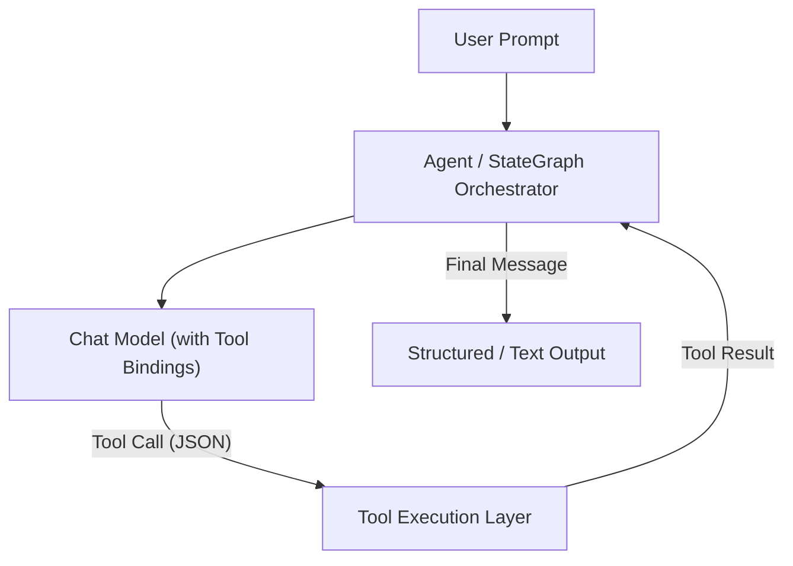
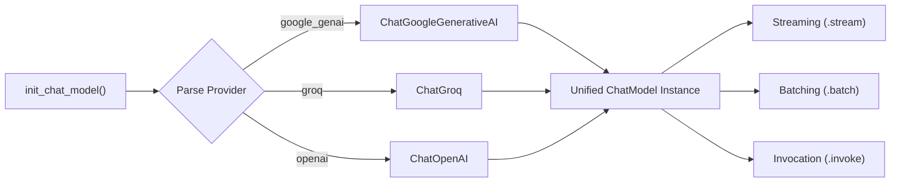
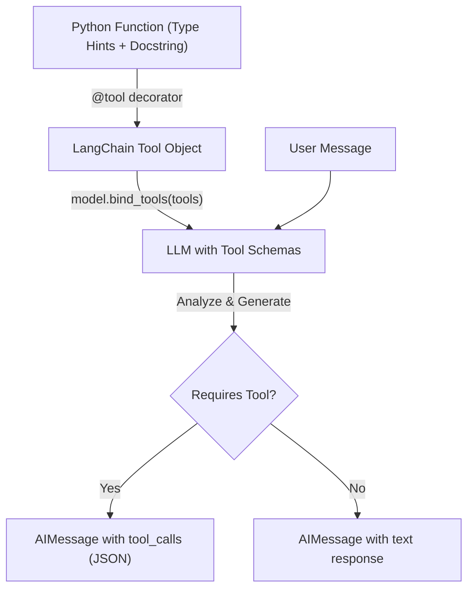
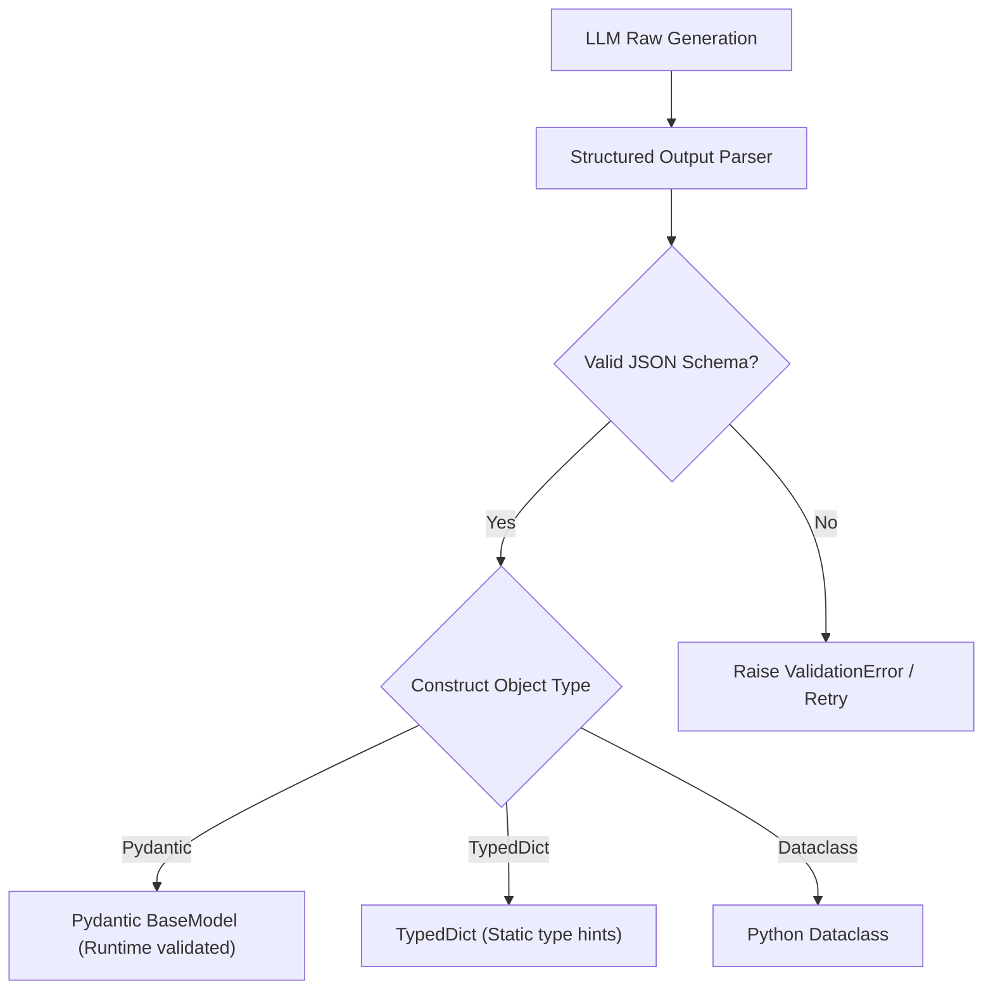
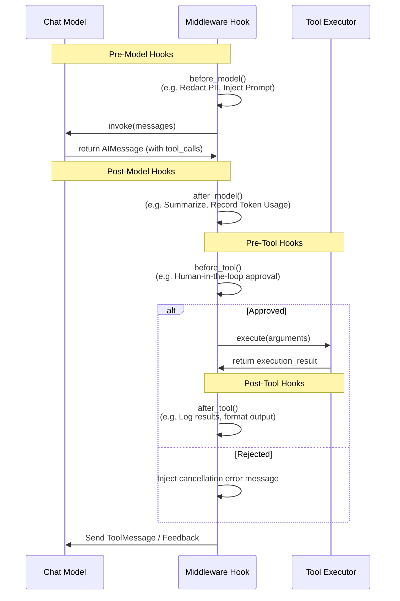

# 📘 LangChain Study Guide & Reference

This folder contains a collection of Jupyter Notebooks (`01_lanchain_intro.ipynb` to `06_middleware.ipynb`) designed to teach the core components of building LLM-driven applications. This guide serves as a comprehensive study guide, focusing on the concepts, patterns, architectures, and best practices implemented in the code.

---

## 🧭 Overview of LangChain Architecture

LangChain is a framework that helps developers orchestrate LLMs, prompts, memories, and external tools into coherent workflows. Rather than treating LLMs as raw text-in/text-out boxes, LangChain models them as **stateful agents** that can interact with their environment.

---

## 📓 Core Concepts Explained

### 1️⃣ Models & Execution Modes
Modern LLM applications require interacting with different model providers. Instead of hardcoding API clients, LangChain uses a unified interface.

*   **Model Initialization (`init_chat_model`)**: Allows dynamic runtime switching between different API providers:
    *   **Google Gemini**: `google_genai:gemini-2.5-flash-lite` (low-latency, long context window).
    *   **Groq**: `groq:qwen/qwen3-32b` (highly efficient open-source model execution).
    *   **OpenAI**: Standard model bindings.
*   **Execution Modes**:
    *   **Streaming (`model.stream()`)**: Emits output chunks as they are generated by the LLM. Essential for human-interactive UIs to reduce perceived latency.
    *   **Batching (`model.batch()`)**: Processes multiple prompt queries concurrently, optimizing throughput and network efficiency when processing large datasets.

---

### 2️⃣ Messages, Prompts, & Templates
Conversational context is represented as a list of message objects.
*   **Message Types**:
    *   `SystemMessage`: Sets the LLM's persona, behavior guidelines, boundaries, and system instructions.
    *   `HumanMessage`: Represents user input.
    *   `AIMessage`: Represents LLM generation (which can include `tool_calls` requesting tool execution).
    *   `ToolMessage`: Feeds the execution output of a tool back to the LLM. It must carry a `tool_call_id` matching the request ID.
*   **Prompt Engineering & Templating**:
    *   `PromptTemplate`: Inserts variables into raw text strings.
    *   `ChatPromptTemplate`: Assembles a structured sequence of messages (e.g. system instructions followed by conversation history and a final human question), formatting inputs dynamically.

---

### 3️⃣ Tool Binding & Schema Generation
To make LLMs agentic, they must invoke code. LangChain achieves this by exposing Python functions as tools.

*   **Tool Schema Generation**: When a Python function is annotated with `@tool`, LangChain parses its name, docstring, and type annotations into a JSON schema conforming to the target LLM's tool-calling specification.
*   **Model Binding (`model.bind_tools([...])`)**: The generated schemas are sent to the LLM during the API handshake, making the model aware of what functions are available and how to query them.

---

### 4️⃣ Structured Output Formatting
By default, LLMs return natural text. Applications require structured, typed data (e.g., database insertions, front-end rendering).

LangChain's `.with_structured_output(schema)` forces the model to output valid JSON matching a schema, parsing the response into a structured Python object.
*   **Pydantic (`BaseModel`)**: Integrates runtime data validation, raising parsing exceptions if fields or types are incorrect.
*   **TypedDict**: Provides static type assertions for key-value structures without enforcing runtime validation.
*   **Dataclasses**: Standard Python container objects.

---

### 5️⃣ Agent Middleware Hooks
Middleware is a powerful pattern to intercept inputs and outputs at crucial execution points. This repository implements two primary middleware utilities:

*   **SummarizationMiddleware**: Controls context window overflow. When the conversation history hits a set threshold, it condenses historical messages into an LLM-generated summary, preserving session state while saving tokens.
    *   *Message-based*: Triggers after a specific number of turns.
    *   *Token-based*: Triggers when token count exceeds a maximum limit.
    *   *Fraction-based*: Triggers when history consumes a defined fraction of the total context budget.
*   **HumanInTheLoopMiddleware**: Pauses execution before executing critical or destructive tools (e.g., database writes, external transactions).
    *   *Approve*: Allows execution to proceed.
    *   *Reject*: Terminates the call or returns a cancellation statement to the LLM.
    *   *Edit*: Allows the human to modify parameters before sending them to the tool.

---

## 📚 Notebook ↔ Concept Mapping

Refer to the following files for concrete code implementations of these concepts:

| Notebook | Core Concepts Covered | Key APIs & Classes Used |
| :--- | :--- | :--- |
| [`01_lanchain_intro.ipynb`](file:///f:/WeCloudData/AI/AgenticAI/langchain_ai/langchain/01_lanchain_intro.ipynb) | Basic agent loop, setup, and initialization | `init_chat_model`, `create_agent` |
| [`02_model_integration.ipynb`](file:///f:/WeCloudData/AI/AgenticAI/langchain_ai/langchain/02_model_integration.ipynb) | Multi-provider execution, Streaming, and Batching | `.stream()`, `.batch()`, `ChatGroq`, `ChatGoogleGenerativeAI` |
| [`03_tools.ipynb`](file:///f:/WeCloudData/AI/AgenticAI/langchain_ai/langchain/03_tools.ipynb) | Declaring and binding tools to an LLM | `@tool`, `model.bind_tools()`, `StructuredTool` |
| [`04_messages.ipynb`](file:///f:/WeCloudData/AI/AgenticAI/langchain_ai/langchain/04_messages.ipynb) | Prompt templating and chat message schema | `ChatPromptTemplate`, `HumanMessage`, `SystemMessage` |
| [`05_structured_output.ipynb`](file:///f:/WeCloudData/AI/AgenticAI/langchain_ai/langchain/05_structured_output.ipynb) | Schema-enforced output parsing and model binding | `model.with_structured_output()`, `BaseModel` |
| [`06_middleware.ipynb`](file:///f:/WeCloudData/AI/AgenticAI/langchain_ai/langchain/06_middleware.ipynb) | Summarization and Human-in-the-loop interceptors | `SummarizationMiddleware`, `HumanInTheLoopMiddleware` |

---

## ✅ Best-Practice Study Checklist

*   **Always type hint and document tools**: The LLM relies solely on the tool's docstring and arguments' type signatures to build its schema and plan function calls.
*   **Enforce schema constraints via Pydantic**: When building production systems, prefer Pydantic for structured outputs as it ensures runtime reliability over basic Python dictionaries.
*   **Stream outputs for conversational interfaces**: Utilize `.stream()` chunks instead of awaiting the complete response to offer a responsive user experience.
*   **Track your context window**: Use token-based summarization middleware to prevent models from exceeding context limits or generating expensive API invoices.
*   **Safety first with Human-in-the-loop**: Never let an LLM run destructive or financial actions autonomously. Integrate approval middleware hooks to inspect and modify arguments before execution.
