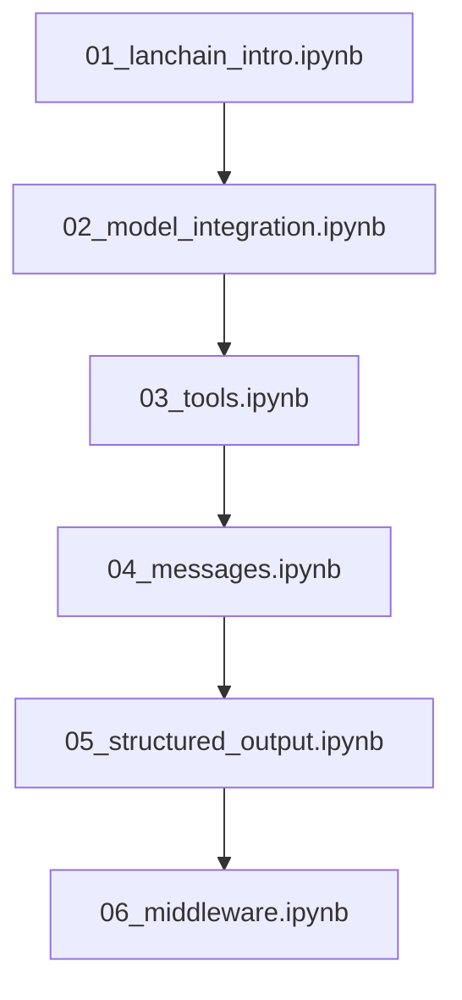
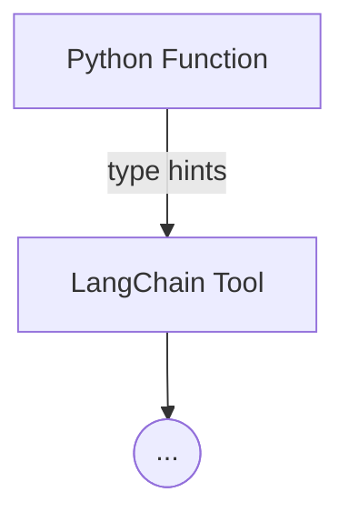
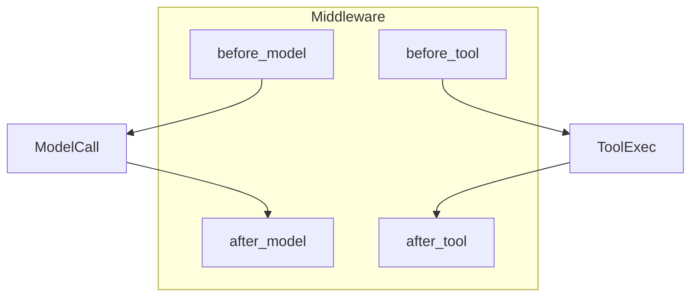
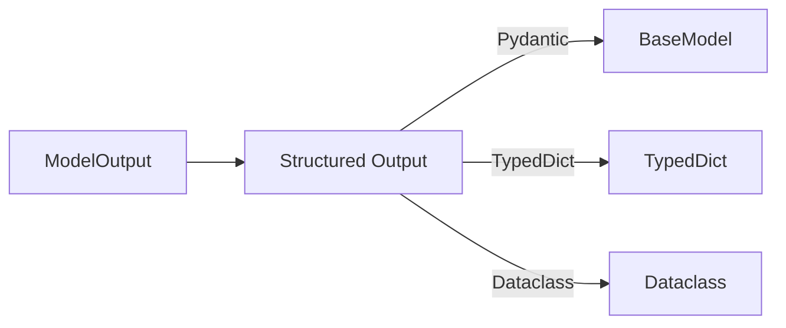

# 📘 LangChain Study Guide

## Overview
This folder contains notebooks that walk through the core **LangChain** concepts used in this project:
- **Agents** – creation via `create_agent`.
- **Tool Binding** – exposing Python functions to the LLM.
- **Middleware** – hooks to intercept model calls and tool execution.
- **Structured Output** – using Pydantic, TypedDict, and dataclasses.

## Notebook Flow


### 1. Agent Creation
```mermaid
flowchart LR
    Model[Chat Model] -->|bind_tools| Tools[Tool List]
    Model -->|system_prompt| Prompt[System Prompt]
    Model --> Agent[Compiled Agent (StateGraph)]
    Agent -->|invoke| User[User Message]
```

### 2. Tool Definition & Binding


### 3. Middleware Hooks


### 4. Structured Output


---

*Each notebook contains runnable examples. Refer to the code cells for concrete implementations.*
